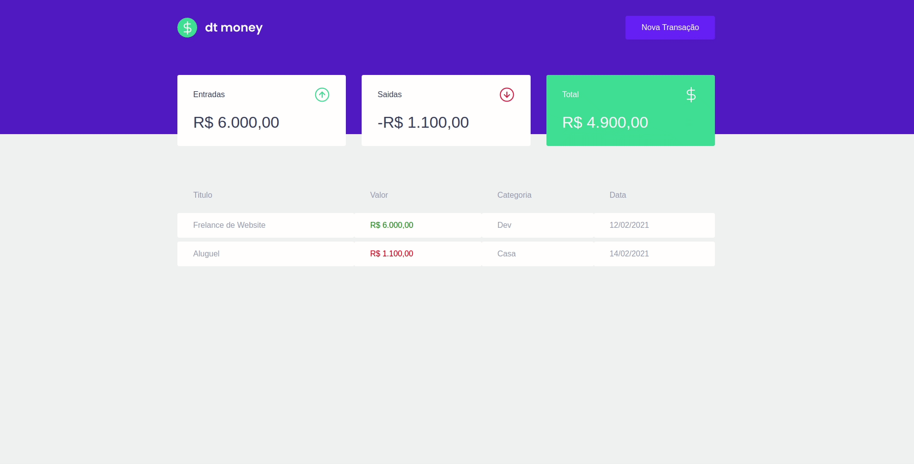

<h1 align="center">dt-money<h1>

<div>
    
<div>

---

## ⌨️ Sobre o projeto

---

Projeto Criado e Apresentado pela Rocketseat💜, neste projeto desenvolvemos um controle de finanças pessoais, com entradas, saídas e total. Podemos tambem, adicionar/cadastrar uma nova Transação , colocando nome, preço, entradas/saídas e a categoria.

---

# 🚀 Tecnologias/Bibliotecas

- ReactJS
- Styled-components
- MirageJS
- React-Modal
- Axios

---

## 📁 Como baixar o projeto

```bash

#clonar o repositório

$ git clone https://github.com/JoaoPedro191/dt-money

#entrar no repositorio

$ cd  dt-money

#entrar no projeto

$ code .

```
